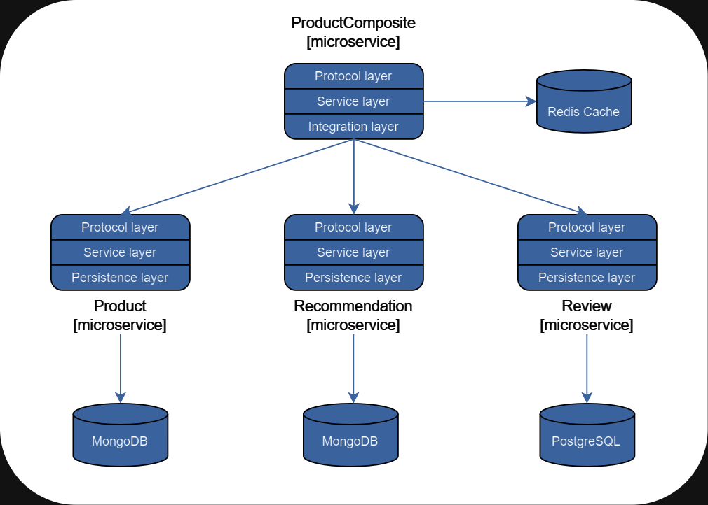

# Spring Data Redis Cache

With this project you'll take a deep dive into the world of caching and explore how to implement Redis cache in a Spring Boot application, 
unlocking its full potential for producing significant performance advantages. 

## Table of contents

- [Introduction to the Cache Abstraction](#Introduction-to-the-Cache-Abstraction)
- [About the project](#about-the-project)
    * [Built with](#built-with)
- [Getting started](#getting-started)
    * [Prerequisites](#prerequisites)
    * [Installation](#installation)
- [Usage](#usage)
- [Roadmap](#roadmap)
- [License](#license)
- [Acknowledgments](#acknowledgments)

## Introduction to the Cache Abstraction

At its essence, the cache abstraction applies caching to Java methods, effectively reducing the number of executions 
based on the cached information. That is, each time a designated method is invoked, the abstraction applies a caching 
behavior that checks whether the method has been previously invoked for the given arguments. If it has been invoked, 
the cached result is retrieved and returned without having to execute the method again. However, If the method hasn't been 
invoked previously, then it is invoked, and the result is cached and returned to the user so that, the next time the method 
is invoked, the cached result is returned. This way, expensive methods (whether CPU- or IO-bound) can be invoked only once 
for a given set of parameters and the result reused without having to actually invoke the method again. The caching logic 
is applied transparently without any interference to the invoker.

One important aspect to consider is that this approach works only for methods that are guaranteed to return the same output
(result) for a given input (or arguments) no matter how many times they are invoked. 

The caching abstraction provides other cache-related operations, such as the ability to update the content of the cache 
or to remove one or all entries. These are useful if the cache deals with data that can change during the course of the 
application.

As with other services in the Spring Framework, the caching service is an abstraction (not a cache implementation) and 
requires the use of actual storage to store the cache data - that is, the abstraction frees you from having to write the 
caching logic but does not provide the actual data store. This abstraction is materialized by the **`org.springframework.cache.Cache`**
and **`org.springframework.cache.CacheManager`** interfaces.

To use the cache abstraction, you need to take care of two aspects:
 * Caching declaration: Identify the methods that need to be cached and their policies.
 * Cache configuration: The backing cache where the data is stored and from which it is read.

## About the project

This project is developed using a small set of cooperating microservices, composed of three core services: product, review, 
and recommendation. Each of them deals with one type of resource and interacts with a specific database. Additionally, 
there is a composite microservice, called the product composite service, which aggregates information from these three core 
services. All of this information is stored in three different databases, one for each core microservice, and the Spring Data 
project is used to persist data to MongoDB and PostgreSQL databases. Specifically, the product and recommendation microservices
use Spring Data for MongoDB and the review microservice uses Spring Data for the Java Persistence API (JPA) to access a 
PostgreSQL database. In addition, the product composite service interacts with a Redis database used as a cache to store 
the results of database retrieval operations, allowing subsequent requests to retrieve the data directly from the cache. 
This significantly improves application performance by reducing unnecessary database calls.\
At the end of this project, we will have layers inside our microservices that will look like the following:

The Protocol layer handles protocol-specific logic. It is very thin, only consisting of the RestController annotations 
in the api project and the common GlobalControllerExceptionHandler in the util project. The main functionality of each 
microservice resides in each Service layer. The product composite service contains an Integration layer used to handle 
the communication with the three core microservices. The core microservices will all have a Persistence layer used for 
communicating with their databases. The cache annotations are integrated into the product composite Service layer, and 
it will invoke the Integration layer only after querying the cache and in case the requested data is not found in the cache. 
In particular, when a request is made, the service initially looks in the Redis cache for the desired data. When a cache hit 
occurs, the data is swiftly retrieved from the cache and promptly provided back to the service, avoiding the need to interact 
with the database. However, if the requested data is not found in the cache (cache miss), the service falls back to the database 
to retrieve the required information. Subsequently, the fetched data is stored in the Redis cache, enabling future requests 
for the same data to be served directly from the cache, thereby eliminating further database queries and speeding up overall 
response times.

### Built with

* [![Spring][Spring.io]][Spring-url]
* [![Redis][Redis.io]][Redis-url]
* [![MongoDB][Mongodb.com]][Mongodb-url]
* [![Postgresql][Postgresql.com]][Postgresql-url]
* [![Ubuntu][Ubuntu.com]][Ubuntu-url]
* [![Java][Java.com]][Java-url]
* [![Java][Jetbrains.com]][Jetbrains-url]

## Getting started
### Prerequisites
### Installation

## Usage

## Roadmap

## License

Distributed under the MIT License. See `LICENSE.txt` for more information.

## Acknowledgments

- [Microservices with Spring Boot 3 and Spring Cloud - Third Edition](https://www.packtpub.com/product/microservices-with-spring-boot-3-and-spring-cloud-third-edition-third-edition/9781805128694)
- [Cache Abstraction](https://docs.spring.io/spring-framework/reference/integration/cache.html)
- [Spring Redis Cache](https://docs.spring.io/spring-data/redis/reference/redis/redis-cache.html)

[Spring.io]: https://img.shields.io/badge/Spring-6DB33F?style=for-the-badge&logo=spring&logoColor=white
[Spring-url]: https://spring.io/
[Redis.io]: https://img.shields.io/badge/redis-%23DD0031.svg?&style=for-the-badge&logo=redis&logoColor=white
[Redis-url]: https://redis.io/
[Mongodb.com]: https://img.shields.io/badge/MongoDB-4EA94B?style=for-the-badge&logo=mongodb&logoColor=white
[Mongodb-url]: https://www.mongodb.com/
[Postgresql.com]: https://img.shields.io/badge/PostgreSQL-316192?style=for-the-badge&logo=postgresql&logoColor=white
[Postgresql-url]: https://www.postgresql.org/
[Ubuntu.com]: https://img.shields.io/badge/Ubuntu-E95420?style=for-the-badge&logo=ubuntu&logoColor=white
[Ubuntu-url]: https://ubuntu.com/
[Java.com]: https://img.shields.io/badge/Java-ED8B00?style=for-the-badge&logo=openjdk&logoColor=white
[Java-url]: https://www.java.com/it/
[Jetbrains.com]: https://img.shields.io/badge/IntelliJ_IDEA-000000.svg?style=for-the-badge&logo=intellij-idea&logoColor=white
[Jetbrains-url]: https://www.jetbrains.com/idea/

